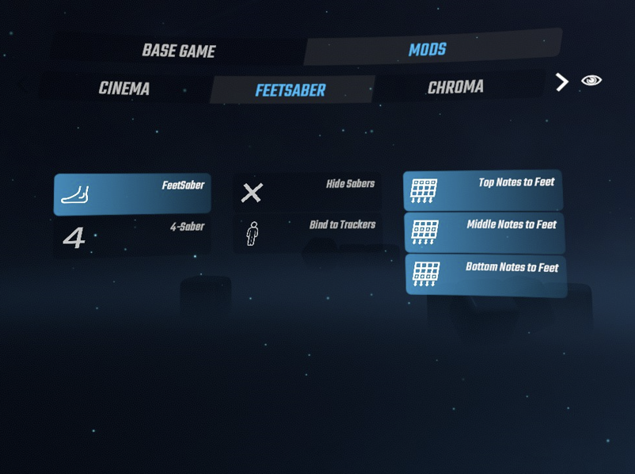

# FeetSaber Modifier for Beat Saber

A FeetSaber mod for Beat Saber which is inspired by [NalulunaModifier](https://github.com/nalulululuna/NalulunaModifier/). Supporting later achieved versions of Beat Saber.

- Game Modes
  - **FeetSaber**: Bind sabers to your foot.
  - **4-Saber**: Beat Saber + FeetSaber (= NinjaSaber in NalulunaModifier)
- Tweaks
  - **Hide Sabers**: Make your sabers invisible. No clash effect and burn mark.
  - **Bind to Trackers**: Bind sabers to trackers if available instead of avatar foot.
  - **Top Notes to Feet**: Move the top notes to foot-level.
  - **Middle Notes to Feet**: Move the middle notes to foot-level.
  - **Bottom Notes to Feet**: Move the bottom notes to foot-level.

# Quick Start

WIP
