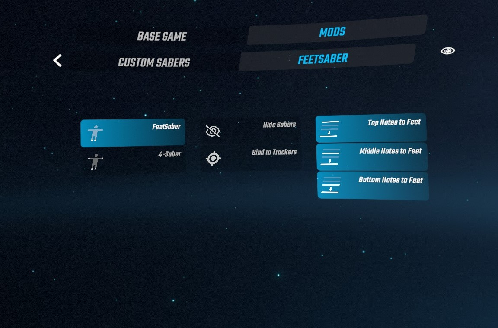

# FeetSaber Modifier for Beat Saber

A game modifier allowing you to hit notes with your feet!

*Inspired by [NalulunaModifier](https://github.com/nalulululuna/NalulunaModifier/).*

## Features

- Allows you to hit notes with your feet or hands.
- Bind sabers to your avatar, trackers, or controllers.
- Adjust note levels to foot-level.

## Options

- **Game Modes**
  - **FeetSaber**: Hit notes with your feet.
  - **4-Saber**: Use both hands and feet to hit notes.
- **Tweaks**
  - **Hide Sabers**: Make sabers invisible.
  - **Bind to Trackers**: Bind sabers to trackers if available, instead of avatar feet.
  - **Top Notes to Feet**: Move top notes to foot-level.
  - **Middle Notes to Feet**: Move middle notes to foot-level.
  - **Bottom Notes to Feet**: Move bottom notes to foot-level.

## Dependencies

- BeatSaberMarkupLanguage
- BS Utils
- (Optional) CustomAvatar

## Quick Start

1. Install the mod and its dependencies.
2. Launch the game and go to the playlist scene.
3. In the `MODS` tab of modifier panel (left), select `FEETSABER`.
4. Choose either `FeetSaber` or `4-Saber`.
5. Adjust other options as needed.
6. Start playing!

### Notes

- For **non-FBT users**: sabers will be bound to your controllers. You may want to strap your controllers to your ankle.
- For **FBT users**: sabers will be bound to your feet trackers.
- For **FBT users** with **avatar enabled**: sabers will be bound to your avatar's feet by default. If you want them bound to your feet trackers instead, please select the `Bind to Trackers` option.

## Known Issues

- Saber trails may not work properly.
